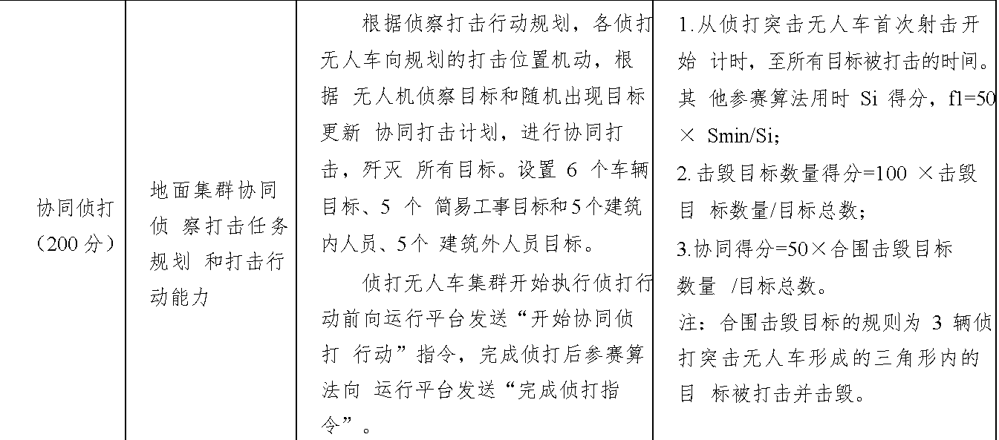

# UnmannedSysetem

 跨越险阻仿真赛训练————多车协同任务

1. 项目介绍
    本项目基于陆军跨越险阻仿真赛的多车协同任务
    多车协同任务目标：
    
    
    
2. 具体控制算法

    2.1 地图获取
    首先根据A*算法获取道路信息，得到道路图片（包含初始位置和最终位置）

    

    但是由于道路的宽度较大，所以导致A*算法（启发式算法常见）会返回一些比较阴间的路径：

    

    因此，使用了erode函数进行优化，将对返回的地图进行加粗，让道路的变窄，只保留最中心的部分。

    ``` python 
        binary_erode = cv2.erode(imgGaussBlur,kernal=np.ones((10,10),dtype=np.uint8))
    ```
    就可以将道路变得更细，这样车也可以非常好地保持在道路中间：
    
    
    2.2 车辆控制算法

    主要思路：通过Frenet坐标系规划车辆的局部最优路径，并通过控制器实现车辆的路径跟踪。
    <video width="320" height="240" controls>
        <source src="./imgs/媒体1.mp4" type="video/mp4">
    </video>

    控制器采用车辆控制的stanley控制器和PID

    stanley控制器:
    计算车辆当前位置到最近路径点的横向距离，即横向偏差。
    根据车辆位置和最近路径点的几何关系，计算横向误差的函数，迭代更新当前位置

    

    2.3 效果展示:
    <video width="320" height="240" controls>
        <source src="./imgs/媒体2.mp4" type="video/mp4">
    </video>